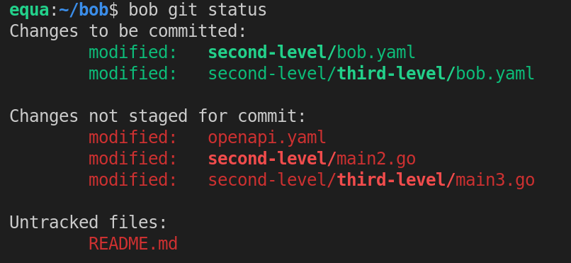

# Bob 
_Inspired by Make and Bazel · Made for humans_

<p>
    <a href="https://github.com/benchkram/bob/releases">
        
    </a>
    <a href="https://pkg.go.dev/github.com/benchkram/bob?tab=doc">
        
    </a>
    <a href="https://github.com/benchkram/bob/actions">
        
    </a>
</p>


Bob is a build system, a task runner as well as tooling for Git Multi-repos, all bundled into a single binary.

With bob, you can:

- **Build** your programs efficiently, as Bob tracks build inputs and caches compiled outputs, providing fast
  incremental builds.
- **Run** local development environments, whether they are simple binaries, docker-compose files, or a mix of both.
- **Multi-Repo Tooling** Easily manage multi-repo setups, with bulk Git operations.

⚠️⚠️⚠️ _Warning: Bob and its documentation is in a early stage. Most of the
features are fully-functional and tested, but some details are yet to be ironed out._

## Install

### Release builds

[Download](https://github.com/benchkram/bob/releases) the latest release from GitHub.
### Install from Source

If you already have Go 1.16 or later installed, the short version is:

```bash
go install github.com/benchkram/bob@latest
```

For shell autocompletion (bash and zsh supported) add `source <(bob completion)` to your `.bashrc`/`.zshrc`.

### Build System

Bobs generates its internal build graph from tasks described in a `bob.yaml` file (we usually refer to it as "bobfile").  
The basic components of a build task are:

- **input**: Whenever an input changes, the task's commands need to be re-executed [default: *]
- **cmd**: Commands to be executed
- **target**: File(s) or directories that are created when the commands are run and can be reused in other tasks.

Example of a `bob.yaml` file:

```yaml
build:
  build:
    input: ./main.go
    cmd: go build -o ./app
    target: ./app
```

Multiline `sh` and `bash` commands are entirely possible, and are powered by [mvdan/sh](https://github.com/mvdan/sh).

Take a look into the [server-db](./example/server-db) example for a step-by-step tutorial.

### Local Development

Our goal is to create a world-class local development experience by integrating seamlessly with the build-system and
enabling you to start right after cloning a repository. Let the build-system create binaries and docker images, then
execute & control them from one terminal using `bob run`. No more back-and-forth tab switching.

Ideally, those are the only two commands necessary to get started when joining a new project that uses Bob:

```bash
git clone
bob run
```

#### Web Server Example

Individual steps for web server development are likely similar to this:

1. Code generation using an [IDL](https://en.wikipedia.org/wiki/Interface_description_language), like openapi or
   protobuf
2. Compile a server binary
3. Run a database in docker
4. Run the server

Those build/run tasks can be described in a _bob.yaml_ file. This allows `bob run` to launch and give you control to a
local development environment.

An in-depth example is available [here](./example/server-db).

### Multi-repo Git Tooling

Bob enables a natural feeling git workflow for Git multi-repo setups without relying on Git Submodules.

To do this, Bob uses the concept of a "workspace" to track other git repositories. Inside a workspace you can use the
usual every day git-operations through bob with visually enhanced output for the multi-repo cases.

Here is an example of `bob git status` in a workspace:



Highlighted directories indicate child Git repositories and therefore `bob git add` and `bob git commit` will only
operate on the repository a file belongs to allowing to create repository overlapping commits all together.

⚠️ So far only `bob clone` and `bob git status` are implemented.

Take a look into the [git package's README](./bobgit/README.md) for the current status of `bob git`

#### Setting Up a Workspace

To set up a new bob workspace you first have to initialize it:

```bash
bob workspace init
```

This creates a _.bob.workspace_ file and initializes a new git repository in the current directory.

Adding repositories to the workspace:

```bash
bob workspace add git@github.com:Benchkram/bob.git
bob clone # calls git clone for missing repos
```

Cloning an existing workspace from a remote git repository:

```bash
bob clone git@github.com:Benchkram/bob.git
```

### Documentation
Full documentation of Bob is available at [bob.build](https://bob.build/docs)
### Dependencies

A list of Bob's top dependencies:

- [charmbracelet/bubbletea](https://github.com/charmbracelet/bubbletea) - Used in Bob's Terminal User Interface
- [docker/compose](https://github.com/docker/compose) - Enables us to run docker-compose files the same way
  `docker compose` does
- [sh](https://github.com/mvdan/sh) - Parsing/execution of shell commands
