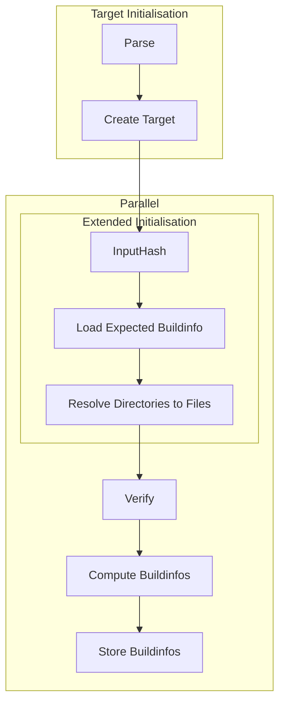

## Lifecycle of a target

## Lifecycle of a task
Parse
Resolve Inputs (Ignore Child Targets)
InputHash
BuildRequired(InputChanged)?
BuildRequired(TargetInvalid)
  Yes
    Clean Targets
    UnpackArtifact
  No
         
    Clean Targets
    Build
        PackArtifacts

               |  Build  | Load | Store |
-------------------------------------------------
InputChanged   |    x    |      |   x   |
TargetChanged  |         |   x  |       |

               |  InputChanged  | TargetChanged |
---------------------------------------------------
InputChanged   |                |     Build     |
TargetChanged  |                |               |

InputHash
BuildinfoExists
LoadTargetFromCache?
    No
        Rebuild

        
    